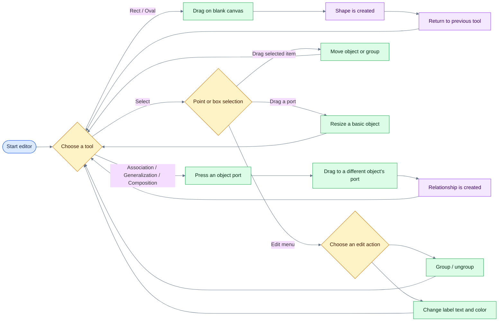
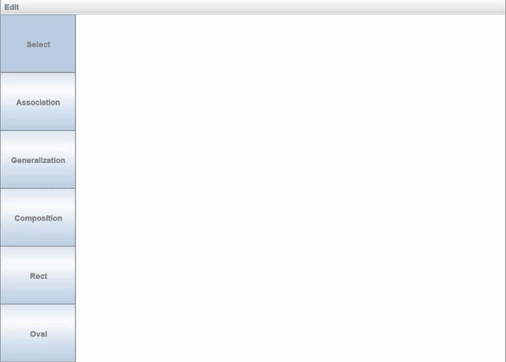
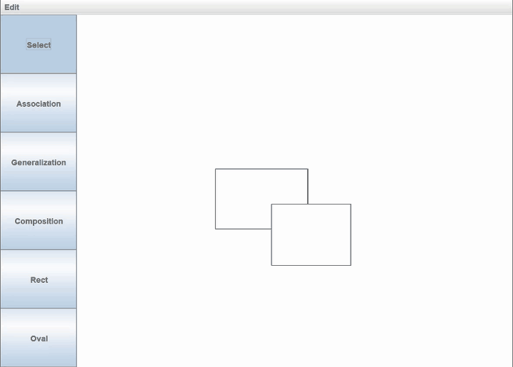
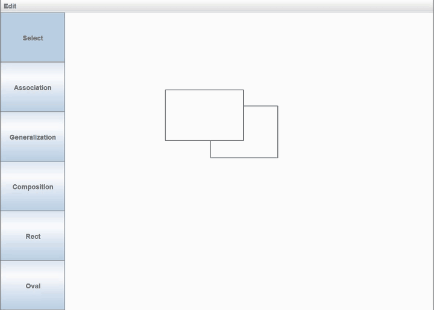
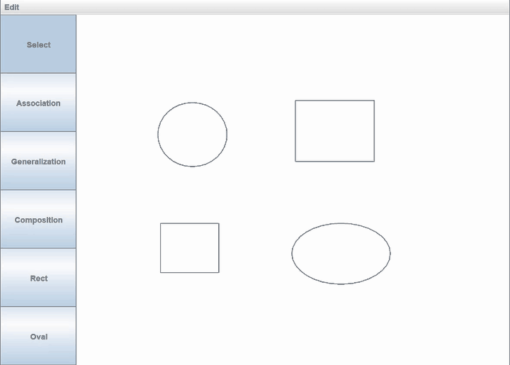
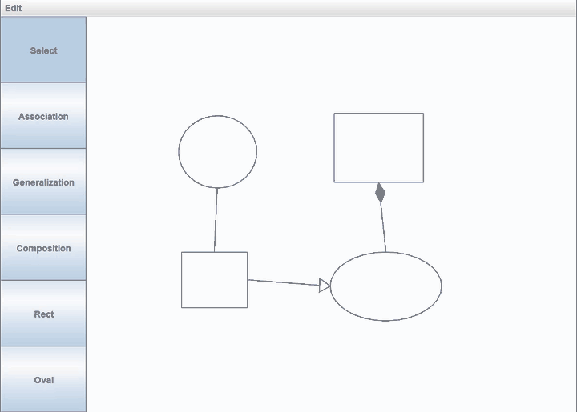
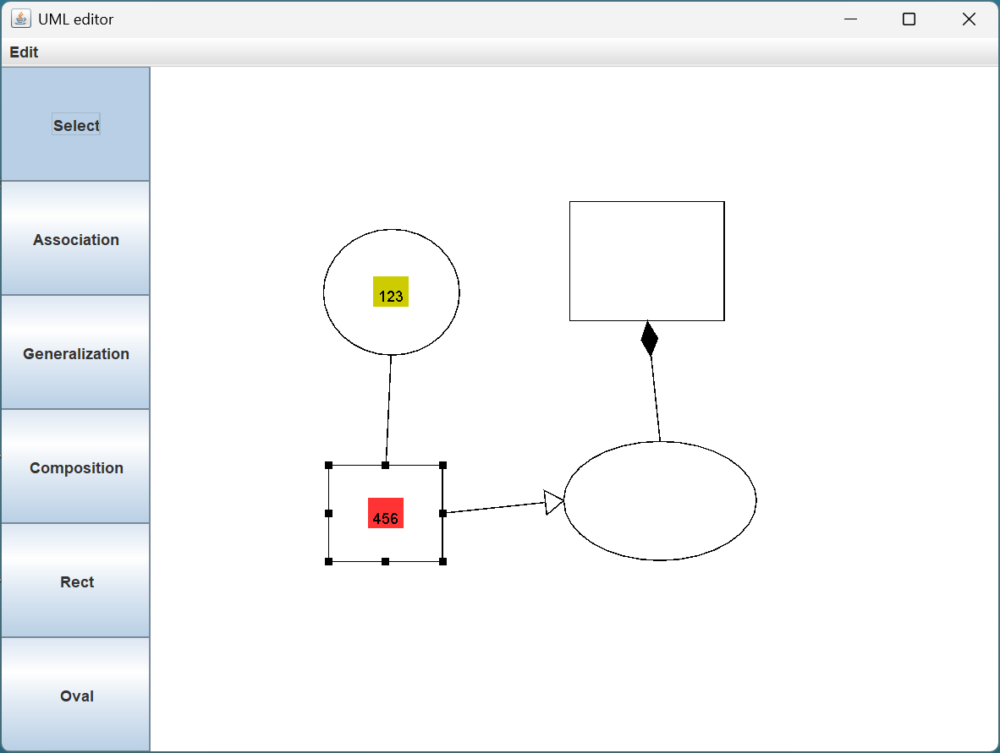

# UML Editor
>OOP Course Project

A desktop UML-diagram editor built with Java Swing.
Provides a canvas where you can create rectangular and oval objects, connect them with three UML relationship styles, arrange and resize objects, group them, and customize their labels.


## Feature

| Feature | Interaction | Result |
| --- | --- | --- |
| Create an object | Choose **Rect** or **Oval**, then drag on the canvas | Creates a shape and returns to the previously selected tool |
| Select objects | Choose **Select**, then click an object or drag a box around multiple objects | Shows the object's connection/resize ports |
| Move objects | Drag a selected object | Moves the selected object or the whole selected group |
| Resize an object | In **Select** mode, drag one of a basic object's ports | Resizes from the opposite anchor; minimum size is 20 x 20 px |
| Create a relationship | Choose a relationship tool and drag from one object's port to another object's port | Adds a link whose endpoints follow the objects when they move or resize |
| Group / ungroup | Box-select objects, then use **Edit > Group**; select a group and use **Edit > Ungroup** | Treats several objects as one movable composite, or separates them again |
| Edit a label | Select one rectangle or oval, then use **Edit > Label** | Changes the centered label text and its background color |

The relationship tools are:

- **Association** - a plain line.
- **Generalization** - a line with a hollow triangle at the destination.
- **Composition** - a line with a filled diamond at the destination.

## Interaction flow



## Getting started

Open the project as a Gradle project in IntelliJ IDEA and run `com.example.umleditor.App.main()`.

## Editor function

### 1. Create shapes

1. Click **Rect** or **Oval** in the left toolbar.
2. Press on the canvas and drag to define the object's size.
3. Release the mouse to create it. Very small shapes are expanded to the 20 x 20 px minimum.

> 

### 2. Select, move, and change stacking order

1. Choose **Select**.
2. Click an object to select it. Hovered and selected basic objects display small black ports.
3. Drag the selected object to move it.

To select several objects, start in empty canvas space and drag a selection box that **fully encloses** them. Links are not selectable. Clicking an object also brings it in front of overlapping objects.

> 

### 3. Resize a shape

1. In **Select** mode, select or hover a basic object so its ports are visible.
2. Drag a port. The opposite side or corner stays anchored.

Rectangles have eight ports (corners and side midpoints); ovals have four (top, right, bottom, and left). Relationship endpoints automatically follow a resized object.

> 

### 4. Create UML relationships

1. Choose **Association**, **Generalization**, or **Composition**.
2. Press near a port on the source object.
3. Drag to a port on a different destination object and release.

A temporary line previews the relationship while dragging. Releasing away from a valid port, or on the source object itself, cancels creation. The triangle or diamond is drawn at the **destination** end.

> 

### 5. Group and ungroup objects

1. In **Select** mode, drag a box that fully encloses at least two objects.
2. Choose **Edit > Group**.
3. Drag the dashed group boundary to move all children together.
4. With that group selected, choose **Edit > Ungroup** to restore its children as separate top-level objects.

Groups may contain basic objects or other groups. A group itself cannot be resized or used as a relationship endpoint.

> 

### 6. Customize a label

1. Select exactly one rectangle or oval.
2. Choose **Edit > Label**.
3. Enter the label text, choose a background color, and click **OK**.

The label is centered in its object. Empty label text hides both the text and its colored background.

The screenshot below shows two customized labels with different text and background colors. A static image is used because label editing opens a separate dialog window.

> 

## Repo Structure

```text
src/main/java/com/example/umleditor/
|-- App.java                              Application entry point
|-- controller/
|   |-- CreateLinkState.java              Creates relationships between object ports
|   |-- CreateObjectState.java            Creates rectangle and oval objects
|   |-- EditorMode.java                   Lists the six toolbar modes
|   |-- EditorState.java                  Base class for mode-specific mouse behavior
|   |-- Selection.java                    Stores selected and hovered objects
|   |-- SelectState.java                  Selects, moves, and resizes objects
|   `-- StateContext.java                 Owns the active state and edit operations
|-- model/
|   |-- CanvasModel.java                  Stores objects, depth, groups, and listeners
|   |-- GraphicObject.java                Base abstraction for every canvas element
|   |-- Label.java                        Draws object text and its background color
|   |-- ModelListener.java                Receives model-change notifications
|   |-- Port.java                         Defines connection and resize handles
|   |-- links/
|   |   |-- AssociationLink.java          Draws a plain association line
|   |   |-- CompositionLink.java          Draws a filled-diamond endpoint
|   |   |-- GeneralizationLink.java       Draws a hollow-triangle endpoint
|   |   `-- Link.java                     Base class for port-to-port relationships
|   `-- objects/
|       |-- BasicObject.java              Base class for shapes with ports and a label
|       |-- CompositeObject.java          Represents a movable group of objects
|       |-- OvalObject.java               Draws and detects oval objects
|       `-- RectObject.java               Draws and detects rectangular objects
`-- view/
    |-- CanvasPanel.java                  Renders the model and forwards mouse events
    |-- LabelDialog.java                  Edits label text and background color
    |-- MainFrame.java                    Builds the main window and Edit menu
    `-- ToolbarPanel.java                 Displays and synchronizes the mode buttons
```

The main runtime path is:

1. `CanvasPanel` forwards mouse events to `StateContext`.
2. `StateContext` delegates each event to the active `EditorState` implementation.
3. The active state updates `CanvasModel`, its objects, or the shared `Selection`.
4. Model listeners ask `CanvasPanel` to repaint; each object draws itself.

Key patterns used by the implementation:

- **State:** `SelectState`, `CreateObjectState`, and `CreateLinkState` isolate mode-specific mouse behavior.
- **Observer:** `CanvasPanel` listens for `CanvasModel` changes and repaints.
- **Composite:** `CompositeObject` lets grouped objects behave like one `GraphicObject`.
- **Template Method:** base shape and link classes define common drawing steps while subclasses render their specific body or endpoint.
